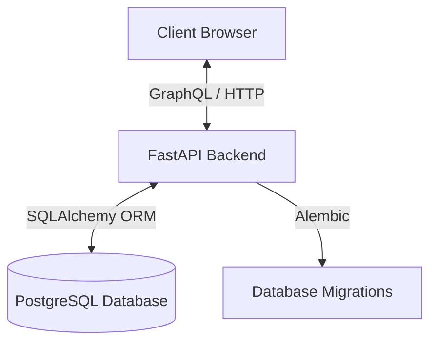

# Architectural Overview: Sensor Data Management System

## 1. Introduction
The Sensor Data Management System is a full-stack application designed to ingest, store, manage, and visualize generic sensor data. It is built with a focus on flexibility, allowing it to handle various sensor types and hierarchical location structures without schema changes. The system utilizes a modern GraphQL API for efficient data retrieval and a React-based frontend for user interaction.

## 2. High-Level Architecture

The system follows a standard three-tier architecture:

1.  **Presentation Layer (Frontend)**: A Single Page Application (SPA) built with React and TypeScript.
2.  **Application Layer (Backend)**: A Python-based REST and GraphQL API built with FastAPI.
3.  **Data Layer (Database)**: A PostgreSQL relational database optimized for time-series data.

## 3. Backend Architecture

### 3.1 Core Frameworks
-   **FastAPI**: Serves as the web framework, providing high performance, automatic OpenAPI documentation, and easy integration with async Python features.
-   **Strawberry GraphQL**: Implements the GraphQL schema, allowing clients to request exactly the data they need.
-   **SQLAlchemy**: The Object-Relational Mapper (ORM) used to interact with the database.
-   **Alembic**: Handles database schema migrations.

### 3.2 Data Models
The database schema is designed to be generic and extensible. Key entities include:

-   **SensorType**: Defines the category of a sensor (e.g., "Temperature", "Humidity") including units and valid ranges.
-   **Location**: A hierarchical entity (Self-referencing adjacency list) allowing for structures like Building -> Floor -> Room.
-   **Sensor**: Represents a physical device, linked to a `SensorType` and a `Location`. It includes metadata like manufacturer, model, and calibration data.
-   **SensorReading**: The core time-series entity. It stores the actual measurement (`value`), timestamp, and quality indicators. It is optimized for high-volume writes.
-   **Alert**: Stores threshold-based or anomaly-based alerts generated from sensor readings.

### 3.3 API Design
-   **GraphQL Endpoint (`/graphql`)**: The primary interface for the frontend.
    -   **Queries**: Fetch sensors, locations, readings (with time-range filtering), and alerts.
    -   **Mutations**: Create/Update sensors, locations, sensor types, and record new readings.
-   **REST Endpoints**:
    -   `/health`: System health check.
    -   `/docs`: Auto-generated API documentation.

## 4. Frontend Architecture

### 4.1 Core Technologies
-   **React 19**: The core UI library.
-   **TypeScript**: Ensures type safety across the application.
-   **Vite**: The build tool and development server, offering fast hot module replacement (HMR).
-   **Apollo Client**: Manages GraphQL state, caching, and network requests.

### 4.2 Key Components
-   **Routing**: `react-router-dom` handles client-side routing for Dashboard, Sensor Lists, and Detail views.
-   **Visualization**: `chart.js` and `react-chartjs-2` are used to render time-series charts of sensor data.
-   **UI Components**: Modular components (Layout, LoadingSpinner, Modal) ensure a consistent user interface.
-   **Icons**: `lucide-react` provides a consistent icon set.

## 5. Data Storage & Optimization

### 5.1 Database Choice
**PostgreSQL** was chosen for its robustness, support for complex queries, and reliability.

### 5.2 Time-Series Optimization
-   **Indexing**: `SensorReading` tables are heavily indexed on `timestamp` and `sensor_id` to ensure fast retrieval of historical data.
-   **UUIDs**: All primary keys use UUIDs to support distributed generation and prevent ID collisions in potential multi-master setups.
-   **JSONB**: `device_metadata` and `alert_metadata` columns use JSON types to allow for flexible, schema-less storage of device-specific attributes.

## 6. Deployment & Infrastructure

-   **Containerization**: Dockerfiles are provided for both frontend and backend services, enabling consistent deployment across environments.
-   **Database Hosting**: Configured to work with managed PostgreSQL services (e.g., Aiven).
-   **Configuration**: The application uses `python-dotenv` to load configuration from `.env` files, adhering to the 12-factor app methodology.

## 7. Security

-   **CORS**: Configured via FastAPI middleware to control access from the frontend application.
-   **Environment Variables**: Sensitive credentials (database URLs, secret keys) are strictly managed via environment variables and never committed to code.
